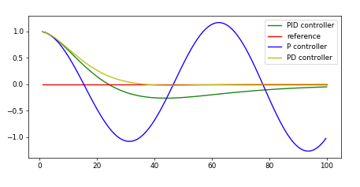

# **CarND-Controls-PID-Project**
## Project Writeup

### 1. Writeup

This writeup describes implementation steps that were taken to address project rubric points.

### 2. Implementation
I've started the project by doing implementation for PID class: 
* `Init` function for setting hyperparameters
* `UpdateError` and `TotalError` functions for setting new proportional error and calculating derivative and integral errors

While tuning initial parameters, it was clear that the speed of the car has a considerable effect on the final trajectory, so I've limited it to 30 mph and introduced acceleration weight: *W<sub>a</sub> = 0.3 ⋅ e<sup>-|α|</sup>*

### 3. Hyperparameter tuning
After some initial testing, I decided to use twiddle to find parameters that minimize the error, it worked good at the start, and I was able to get some useful insight. Still, in the end, it wasn't possible to take advantage of it as some parameter combinations are causing the vehicle to oscillate on very high frequency such that the vehicle is not possible to progress forward. Unfortunately, there is no available information about the vehicle position to incorporate it as part of the error.
Then I switched to tuning parameters manually. I have started with defining a good proportional coefficient. I have taken into account that angle range is [-1, 1] and the max absolute CTE where car doesn't leave the road is around 3.5. Then I've calculated the coefficient so near the edge of the road it gives 2/3 of the max angle - C<sub>p</sub> = 0.66 / 3.2 ≈ 0.2. After this I've added diferential coefficient of 0.5 and started tuning it up and down based on the test lap results. After several steps of adjustments, I was satisfied and then have chosen the coefficient for the integral part in such a way that it doesn't influence the trajectory much.

### 3. Results
The vehicle can drive around the track passing some parts without oscillating at all and some with moderate magnitude oscillating.

### 4. Discussion
The PID in controller name stands for:
* proportional - this part influences how aggressive reaction would be on cross-track error, for bigger values controller tend to overshoot, for smaller it can take to much time to get on the line
* integral - this part tries to cancel the accumulated error which can be caused by the position drift, small values might no be able to cancel the effect, bigger values can be too sensitive to local accumulated error instead of total
* derivative - this part helps to minimize the overshooting that causes the vehicle to oscillate, by decreasing signal strength after the error was decreased successfully in the previous step

A good representation of how P, PD, and PID controllers solve the same problem is seen on the plot from the course plot:



Some nonidealities are present in the PID controller implementation, as I have found it challenging to set up it to incorporate changes in speed. Also, the decisions made suffer from a lack of path prediction; some path planning input would be beneficial here.

## Dependencies

* cmake >= 3.5
 * All OSes: [click here for installation instructions](https://cmake.org/install/)
* make >= 4.1(mac, linux), 3.81(Windows)
  * Linux: make is installed by default on most Linux distros
  * Mac: [install Xcode command line tools to get make](https://developer.apple.com/xcode/features/)
  * Windows: [Click here for installation instructions](http://gnuwin32.sourceforge.net/packages/make.htm)
* gcc/g++ >= 5.4
  * Linux: gcc / g++ is installed by default on most Linux distros
  * Mac: same deal as make - [install Xcode command line tools]((https://developer.apple.com/xcode/features/)
  * Windows: recommend using [MinGW](http://www.mingw.org/)
* [uWebSockets](https://github.com/uWebSockets/uWebSockets)
  * Run either `./install-mac.sh` or `./install-ubuntu.sh`.
  * If you install from source, checkout to commit `e94b6e1`, i.e.
    ```
    git clone https://github.com/uWebSockets/uWebSockets 
    cd uWebSockets
    git checkout e94b6e1
    ```
    Some function signatures have changed in v0.14.x. See [this PR](https://github.com/udacity/CarND-MPC-Project/pull/3) for more details.
* Simulator. You can download these from the [project intro page](https://github.com/udacity/self-driving-car-sim/releases) in the classroom.

Fellow students have put together a guide to Windows set-up for the project [here](https://s3-us-west-1.amazonaws.com/udacity-selfdrivingcar/files/Kidnapped_Vehicle_Windows_Setup.pdf) if the environment you have set up for the Sensor Fusion projects does not work for this project. There's also an experimental patch for windows in this [PR](https://github.com/udacity/CarND-PID-Control-Project/pull/3).

## Basic Build Instructions

1. Clone this repo.
2. Make a build directory: `mkdir build && cd build`
3. Compile: `cmake .. && make`
4. Run it: `./pid`. 

Tips for setting up your environment can be found [here](https://classroom.udacity.com/nanodegrees/nd013/parts/40f38239-66b6-46ec-ae68-03afd8a601c8/modules/0949fca6-b379-42af-a919-ee50aa304e6a/lessons/f758c44c-5e40-4e01-93b5-1a82aa4e044f/concepts/23d376c7-0195-4276-bdf0-e02f1f3c665d)

## Original ReadMe
Original ReadMe is available [here](README-Udacity.md)